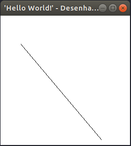
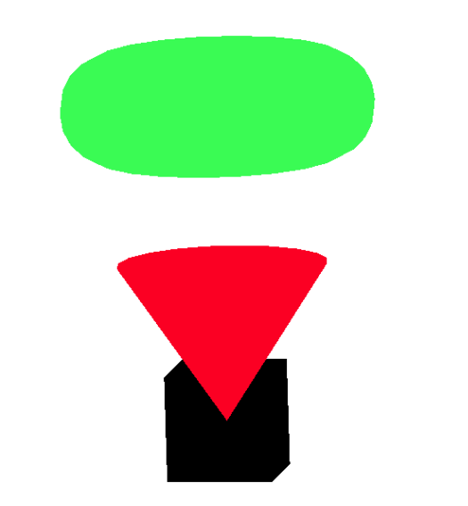

<h1 align="center"></img></h1>

<!-- <h1 align="center"> OpenGL</h1> -->
<p align="center"> O OpenGL é uma API de renderização gráfica que é independente do sistema operacional, independente do sistema de janelas e possui imagens coloridas de alta qualidade compostas por primitivas geométricas e de imagem.
 </p>
<p align="center">
  <a href="https://opensource.org/licenses/MIT">
    
  </a>
</p>

## Features
APIs OpenGL podem usar as seguintes…


- 💹 **GI** — [Implementação da API OpenGL](http://www.opengl.org)
- 🛢️ **GLU** — Utilitário OpenGL
- 💅 **Glut** — GLUT(OpenGL Utility Toolkit).
- O Glut é uma API de janelas portável e não faz parte oficialmente do OpenGL. [OpenGL Utility Toolkit](http://www.opengl.org/resources/libraries/glut/)
- 💹 **FLTK** — [FlashLight ToolKit](http://www.fltk.org/)
- 🛢️ **GLEW** — É distribuído como fonte e binários pré-compilados. [ Biblioteca Openran Extension Wrangler](http://glew.sourceforge.net/)


## :books: Instalação

### Como instalar o OpenGL no Ubuntu Linux
Agora vamos ver Como instalar o OpenGL no Ubuntu OS.
Agora, como o GLUT (OpenGL Utility Toolkit) depende do OpenGL e de várias outras bibliotecas relacionadas, se instalarmos o GLUT, o OpenGL será instalado automaticamente.
Execute os seguintes comandos para instalar o **OpenGL** execute:

```bash
sudo apt-get update
sudo apt-get install libglu1-mesa-dev freeglut3-dev mesa-common-dev
```
Agora, para testar se as bibliotecas OpenGl estão funcionando bem em nosso Linux, criaremos um programa C ++ e testá-lo.
Portanto, para compilar e executar  o programa salve o arquivo como **linha.cpp**
```bash

#include <GL/glut.h>
#include <stdlib.h>

void init(void);
void display(void);
void keyboard(unsigned char key, int x, int y);

int main(int argc, char** argv){
    glutInit(&argc, argv);
    glutInitDisplayMode(GLUT_SINGLE | GLUT_RGB);
    glutInitWindowSize(256,256);
    glutInitWindowPosition(100,100);
    glutCreateWindow("'Hello world' - Desenhando uma linha");
    init();
    glutDisplayFunc(display);
    glutKeyboardFunc(keyboard);
    glutMainLoop();
    return 0;
}
void init(void){
    glClearColor(1.0, 1.0, 1.0, 1.0);
    glOrtho(0, 256, 0, 256, -1, 1);
}

void display(void){
    glClear(GL_COLOR_BUFFER_BIT);
    glColor3f(0.0, 0.0, 0.0);
    glBegin(GL_LINES);
    glVertex2i(40,200);
    glVertex2i(200,10);
    glEnd();
    glFlush();
}

void keyboard(unsigned char key, int x, int y){
    switch(key){
    case 27:
        exit(0);
        break;
    }
}

```
Agora, dê o comando abaixo para compilar seu código com o nome do arquivo, como no exemplo, **linha.cpp**
```bash
g++ linha.cpp -o firstOpenGlApp -lglut -lGLU -lGL
```
Agora execute o seu programa OpenGl com o seguinte comando
```bash
./firstOpenGlApp
```

## RESULTADO:

<h1 align="center"></img></h1>

Se uma janela aparecer quando você executa o programa, o OpenGL está trabalhando no seu sistema operacional Ubuntu.

### Como instalar o OpenGL no Windows
Execute os seguintes passos para **instalar glut em Code::Block**:

- 1. Instalar Code:Block, 32 bit
  - a. Baixar Code:Block (http://www.codeblocks.org/downloads)
  - b. Configurar o compilador: Setting-Comiler Setting – Toolchain executables – Auto-detect.

- 2. Instalar GLUT. 32 bit
  - a. Baixar glut-3.7.6-bin.zip (117 KB) – descompactar
  (https://osdn.net/projects/sfnet_colladaloader/downloads/colladaloader/colladaloader%201.1/glut-3.7.6-bin.zip/)
  - b. Copiar glut.h para \\ CodeBlocks \ MinGW \ include \ GL
  - c. Copiar glut32.lib para \\ Arquivos de Programas \ CodeBlocks \ MinGW \ lib,
  - d. Copiar glut32.dll para C: \ Windows \ System32

- Code: Block criar o projeto GLUT OpenGL
  - Especificar localizações de GLUTs **\\ CodeBlocks \ MinGW**
  - Adicionar em main.cpp **#include <windows.h>**
  - **Pronto**

- Video de como configurar o OpenGL e GLUT com CodeBlocks no Windows
  [Video Instalar OpenGL en Code:Block](https://www.youtube.com/watch?v=Le4ub4apbn0)

###  OpenGL na Computação Gráfica
A seguir, daremos algumas dicas de sites que irão ajudá-lo a aproveitar ao máximo seu momento de estudo.

```bash
Introdução à computação gráfica com OpenGL
Prof. Marco Antonio G. Carvalho
Julho/2006
```
- 💹 **Prof. Marco Antonio G. Carvalho - Julho/2006** — [Introdução à computação gráfica com OpenGL](https://www.ft.unicamp.br/~magic/opengl/index2006.html)


```bash
Guia de programação do OpenGL
ou "O Livro Vermelho"
```
- 💹 **Guia de programação do OpenGL** — (https://www.ft.unicamp.br/~magic/redbook/index.html)


```bash
Introdução à OpenGL
Professora Isabel Harb Manssour
```
- 💹 **Professora Isabel Harb Manssour** — (https://www.inf.pucrs.br/~manssour/OpenGL/Tutorial.html)

```bash
Introdução à computação gráfica com OpenGL
Agostinho Brito Version 0.9, (c)2006-15
```
- 💹 **Agostinho Brito** — (https://agostinhobritojr.github.io/tutorial/opengl/)

```bash
O Guia Oficial de Aprendizagem OpenGL, Versão 1.1
```
- 💹 **Guia de programação do OpenGL** — (https://www.glprogramming.com/red/index.html)

- 💹 **Capítulo 12 Avaliadores e NURBS** — (https://www.glprogramming.com/red/chapter12.html)


###  Exercícios com Solução - OpenGL na Computação Gráfica

```bash
A partir deste código foi obtido uma imagem na tela como pode ser visto de três Sólidos

/*
 * GLUT Shapes Demo
 *
 * Written by Nigel Stewart November 2003
 *
 * This program is test harness for the sphere, cone
 * and torus shapes in GLUT.
 *
 * Spinning wireframe and smooth shaded shapes are
 * displayed until the ESC or q key is pressed.  The
 * number of geometry stacks and slices can be adjusted
 * using the + and - keys.
 */

#ifdef __APPLE__
#include <GLUT/glut.h>
#else
#include <GL/glut.h>
#endif

#include <stdlib.h>

// prototipos das funcoes
void init(void);
void display(void);
void keyboard(unsigned char key, int x, int y);

// funcao principal
int main(int argc, char** argv){
  glutInit(&argc, argv);                              // inicializa o glut
  glutInitDisplayMode (GLUT_SINGLE | GLUT_RGB);           // especifica o uso de cores e buffers
  glutInitWindowSize (800, 800);                          // especifica as dimensoes da janela
  glutInitWindowPosition (100, 100);                      // especifica aonde a janela aparece na tela
  glutCreateWindow ("Tres Solidos");              // cria a janela
  init();
  glutDisplayFunc(display);                               // funcao que sera redesenhada pelo GLUT
  glutKeyboardFunc(keyboard);                             // funcoes de teclado
  glutMainLoop();                                         // mostra todas as janelas criadas
  return 0;
}

// definicao de cada funcao

void init(void){
  glClearColor(1.0, 1.0, 1.0, 1.0);    // cor de fundo
  glMatrixMode( GL_PROJECTION );
  glLoadIdentity();
  glOrtho (0, 256, 0, 256, -500.0 ,500.0);     // modo de projecao ortogonal
  glMatrixMode( GL_MODELVIEW );
  glLoadIdentity();


  glTranslatef(0.0,60.0,0.0);
  glRotatef(90.0, 1.0, 0.0, 0.0);
  glRotatef(10.0, 0.0, 0.0, 1.0);
  glRotatef(10.0, 1.0, 0.0, 0.0);
}


void display(void){
  glClear(GL_COLOR_BUFFER_BIT);               // limpa a janela
  glColor3f (0.0, 0.0, 0.0);                  // cor do ponto

  glPushMatrix();
  glTranslatef (150.0, 150.0, 0.0);
  glutSolidCube(40.0);
  glPopMatrix();

  glColor3f (1.0, 0.0, 0.0);
  glPushMatrix();
  glTranslatef (150.0, 150.0, -60.0);
  glutSolidCone(40.0,60.0,20,20);
  glPopMatrix();

  glColor3f (0.0, 1.0, 0.0);
  glPushMatrix();
  glTranslatef (150.0, 150.0, -120.0);
  glutSolidTorus(20,40,20,20);
  glPopMatrix();

  glFlush();
}

void keyboard(unsigned char key, int x, int y){

  switch (key) {
  case 27:                                         // tecla Esc (encerra o programa)
	exit(0);
	break;
  }
}

```
## RESULTADO:

<h1 align="center"></img></h1>

----------
Feito com ♥ by Tayna Rodrigues - Manaus-AM  👋 