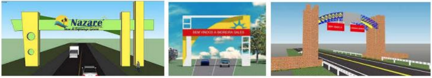
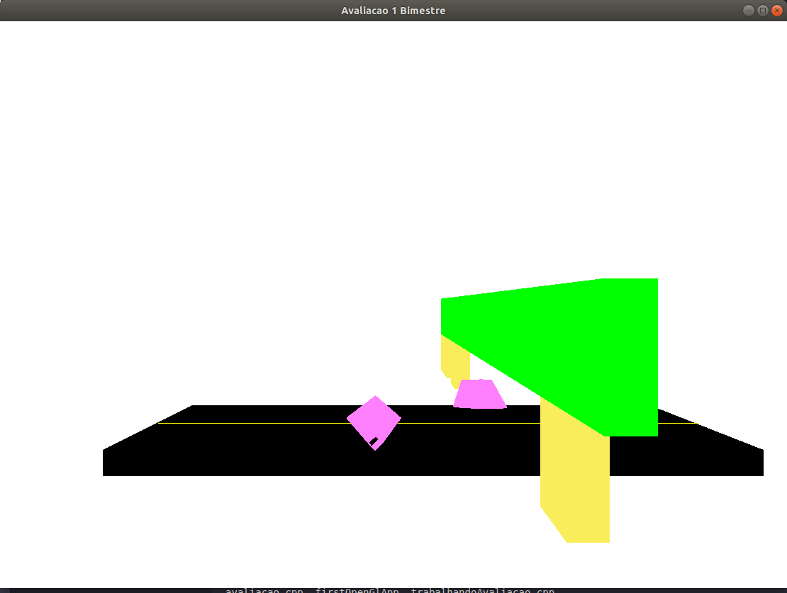

### Modelar via OpenGL uma cena gráfica
Modelar via OpenGL uma cena gráfica que contenha a simulação de um portal de entrada de
uma cidade, contendo a via principal, a estrutura do portal e pelo menos 3 outros elementos.
Use objetos sólidos na modelagem. Use também teclas (ou mouse) para permitir a iteração do
usuário com a cena.
## Exemplos:
<h1 align="center"></img></h1>

## RESULTADO:

<h1 align="center"></img></h1>