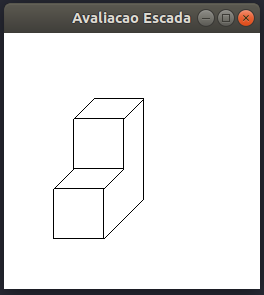

### Desenho do Degrau

## RESULTADO:

## Degrau Escada:

<h1 align="center"></img></h1>

### Desenhar dois polígonos em uma janela com fundo branco 
Este programa deverá desenhar dois polígonos em uma janela com fundo branco de dimensões 256x256 pixels. Todos os polígonos devem estar inicialmente preenchidos com cores diferentes. A cada vez que o usuário clicar com o mouse (botão direito) sob um polígono, deverá aparecer um ponto de cor aleatória no local clicado. Essa cor deverá ser impressa na janela Terminal (as componentes R,G,B), juntamente com as coordenadas (x,y) do ponto clicado.

## RESULTADO:

## Polígonos em uma janela com fundo branco :

<h1 align="center"></img></h1>