### Desenhar duas curvas
* uma usando uma representação analítica não paramétrica
* outra usando uma representação analítica paramétrica

## RESULTADO:

## Curva Paramétrica:

<h1 align="center">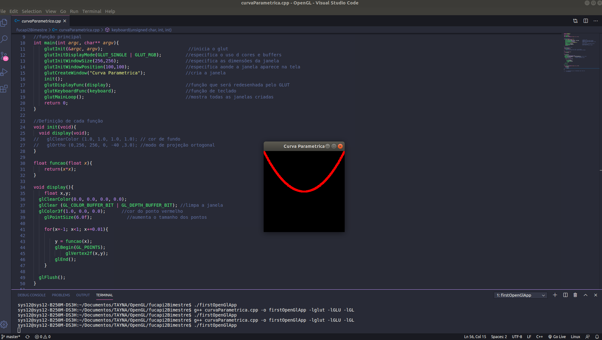</img></h1>

## Curva Não Paramétrica:

<h1 align="center">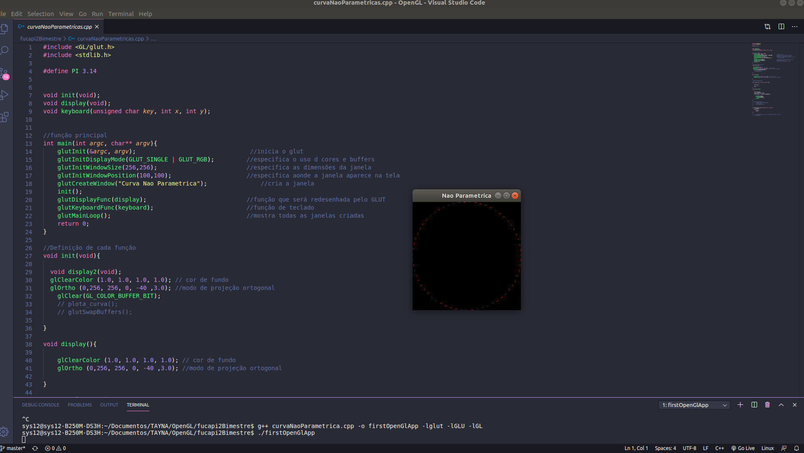</img></h1>

## Curva De Bézier:

<h1 align="center">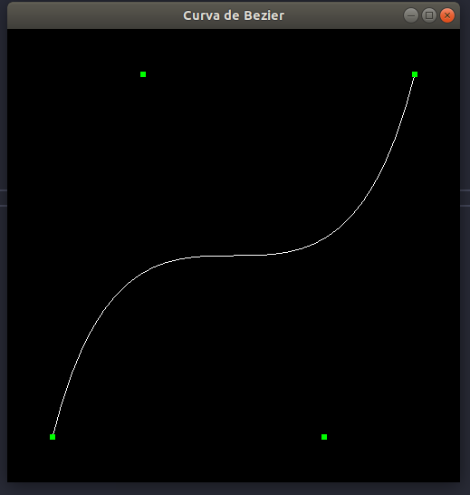</img></h1>


## Curva de Bezier por parte.
Fazer as seguintes curvas de Bezier por parte usando OpenGL (ver imagem)
### Exemplos:
<h1 align="center">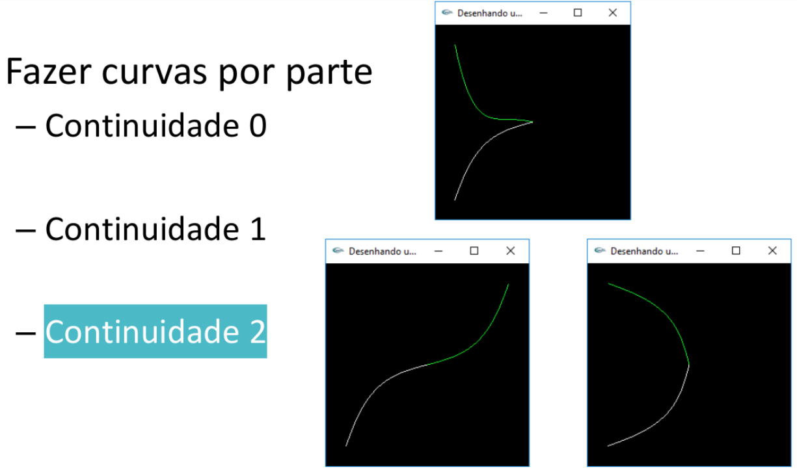</img></h1>

```bash
Curva Bezier Continuidade 0
```
```bash
#include <GL/gl.h>
#include <GL/glu.h>
#include <stdlib.h>
#include <GL/glut.h>

GLfloat ctrlpoints[3][3] = {
  {-3.9, -3.9, 0.0},
  {-3.6, -0.6, 0.0},
  { 0.0,  0.0, 0.0}
};

GLfloat ctrlpoints2[3][3] = {
  { 0.0, 0.0, 0.0},
  {-3.6, 0.6, 0.0},
  {-3.9, 3.9, 0.0}
};
void init(void)
{
   glClearColor(0.0, 0.0, 0.0, 0.0); //cor fundo preto
   glShadeModel(GL_FLAT);
  
   glEnable(GL_MAP1_VERTEX_3);
}

void display(void)
{
   int i;

   glClear(GL_COLOR_BUFFER_BIT);

   //CURVA 1
   glMap1f(GL_MAP1_VERTEX_3, 0.0, 1.0, 3, 3, &ctrlpoints[0][0]);

   glColor3f(1.0, 1.0, 1.0);//cor linha branca

   glBegin(GL_LINE_STRIP);
      for (i = 0; i <= 30; i++) 
         glEvalCoord1f((GLfloat) i/30.0);
   glEnd();

   glPointSize(0.0f); //tamanho do ponto verde
   glColor3f(0.0, 1.0, 0.0);
   glBegin(GL_POINTS);
      for (i = 0; i < 3; i++) 
         glVertex3fv(&ctrlpoints[i][0]);
   glEnd();

   //CURVA 2
   glMap1f(GL_MAP1_VERTEX_3, 0.0, 1.0, 3, 3, &ctrlpoints2[0][0]);

    glColor3f(0.0, 1.0, 0.0); //COR VERDE

    glBegin(GL_LINE_STRIP);
      for (int j = 0; j <= 30; j++) {
        glEvalCoord1f((GLfloat)j / 30.0);
    }
    glEnd();

   glBegin(GL_POINTS);
      for (int i = 0; i < 3; i++) {
        glVertex3fv(&ctrlpoints2[i][0]);
    }
    glEnd();

   glFlush();
   glutSwapBuffers();
}

void reshape(int w, int h)
{
   glViewport(0, 0, (GLsizei) w, (GLsizei) h);
   glMatrixMode(GL_PROJECTION);
   glLoadIdentity();
   if (w <= h)
      glOrtho(-5.0, 5.0, -5.0*(GLfloat)h/(GLfloat)w, 
               5.0*(GLfloat)h/(GLfloat)w, -5.0, 5.0);
   else
      glOrtho(-5.0*(GLfloat)w/(GLfloat)h, 
               5.0*(GLfloat)w/(GLfloat)h, -5.0, 5.0, -5.0, 5.0);
   glMatrixMode(GL_MODELVIEW);
   glLoadIdentity();
}

int main(int argc, char** argv)
{
   glutInit(&argc, argv);
   glutInitDisplayMode (GLUT_SINGLE | GLUT_RGB);
   glutInitWindowSize (500, 500);
   glutInitWindowPosition (100, 100);
    glutCreateWindow("Curva Bezier Continuidade 0");               //cria a janela
   init ();
   glutDisplayFunc(display);
   glutReshapeFunc(reshape);
   glutMainLoop();
   return 0;
}

```
## RESULTADO Curva Bezier Continuidade 0:

<h1 align="center">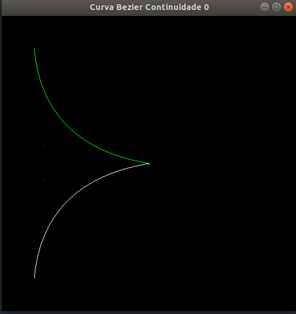</img></h1>

```bash
Curva Bezier Continuidade 1
```
```bash
#include <GL/gl.h>
#include <GL/glu.h>
#include <stdlib.h>
#include <GL/glut.h>

GLfloat ctrlpoints[3][3] = {
  {-3.8, -3.8, 0.0},
  {-3.6, -0.6, 0.0},
  { 0.0,  0.0, 0.0}
};

GLfloat ctrlpoints2[3][3] = {
  {0.0, 0.0, 0.0},
  {3.6, 0.6, 0.0},
  {3.8, 3.8, 0.0}
};
void init(void)
{
   glClearColor(0.0, 0.0, 0.0, 0.0); //cor fundo preto
   glShadeModel(GL_FLAT);
   glEnable(GL_MAP1_VERTEX_3);
}

void display(void)
{
   int i;

   glClear(GL_COLOR_BUFFER_BIT);
   glColor3f(1.0, 1.0, 1.0);

   //CURVA 1
   glMap1f(GL_MAP1_VERTEX_3, 0.0, 1.0, 3, 3, &ctrlpoints[0][0]);  
   glBegin(GL_LINE_STRIP);
      for (i = 0; i <= 30; i++) 
         glEvalCoord1f((GLfloat) i/30.0);
   glEnd();

   glPointSize(0.0f); //tamanho do ponto verde

   glColor3f(0.0, 1.0, 0.0);
   glBegin(GL_POINTS);
      for (i = 0; i < 3; i++) 
         glVertex3fv(&ctrlpoints[i][0]);
   glEnd();

   //CURVA 2
   glMap1f(GL_MAP1_VERTEX_3, 0.0, 1.0, 3, 3, &ctrlpoints2[0][0]);

    glColor3f(0.0, 1.0, 0.0);

    glBegin(GL_LINE_STRIP);
      for (int j = 0; j <= 30; j++) {
        glEvalCoord1f((GLfloat)j / 30.0);
    }
    glEnd();

    glBegin(GL_POINTS);
      for (int i = 0; i < 3; i++) {
        glVertex3fv(&ctrlpoints2[i][0]);
    }
    glEnd();
   glFlush();
   glutSwapBuffers();
}

void reshape(int w, int h)
{
   glViewport(0, 0, (GLsizei) w, (GLsizei) h);
   glMatrixMode(GL_PROJECTION);
   glLoadIdentity();
   if (w <= h)
      glOrtho(-5.0, 5.0, -5.0*(GLfloat)h/(GLfloat)w, 
               5.0*(GLfloat)h/(GLfloat)w, -5.0, 5.0);
   else
      glOrtho(-5.0*(GLfloat)w/(GLfloat)h, 
               5.0*(GLfloat)w/(GLfloat)h, -5.0, 5.0, -5.0, 5.0);
   glMatrixMode(GL_MODELVIEW);
   glLoadIdentity();
}

int main(int argc, char** argv)
{
   glutInit(&argc, argv);
   glutInitDisplayMode (GLUT_SINGLE | GLUT_RGB);
   glutInitWindowSize (500, 500);
   glutInitWindowPosition (100, 100);
    glutCreateWindow("Curva Bezier Continuidade 1");               //cria a janela
   init ();
   glutDisplayFunc(display);
   glutReshapeFunc(reshape);
   glutMainLoop();
   return 0;
}

```
## RESULTADO Curva Bezier Continuidade 1:

<h1 align="center">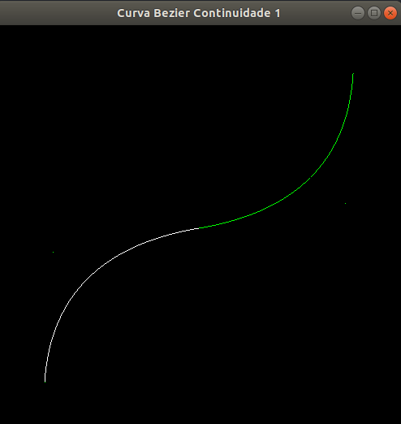</img></h1>

```bash
Curva Bezier Continuidade 2
```
```bash
#include <GL/gl.h>
#include <GL/glu.h>
#include <stdlib.h>
#include <GL/glut.h>

GLfloat ctrlpoints[3][3] = {
  {-3.5, -3.5, 0.0},
  {-0.6, -3.6, 0.0},
  { 0.0,  0.0, 0.0}
};

GLfloat ctrlpoints2[3][3] = {
  { 0.0, 0.0, 0.0},
  {-0.6, 3.6, 0.0},
  {-3.5, 3.5, 0.0}
};

void init(void)
{
   glClearColor(0.0, 0.0, 0.0, 0.0); //cor fundo preto
   glShadeModel(GL_FLAT);
   glEnable(GL_MAP1_VERTEX_3);
}

void display(void)
{
   int i;

   glClear(GL_COLOR_BUFFER_BIT);

   //CURVA 1
   glMap1f(GL_MAP1_VERTEX_3, 0.0, 1.0, 3, 3, &ctrlpoints[0][0]);

   glColor3f(1.0, 1.0, 1.0);//cor linha branca

   glBegin(GL_LINE_STRIP);
      for (i = 0; i <= 30; i++) 
         glEvalCoord1f((GLfloat) i/30.0);
   glEnd();

   glPointSize(0.0f); //tamanho do ponto 
   glColor3f(0.0, 1.0, 0.0);

   glBegin(GL_POINTS);
      for (i = 0; i < 3; i++) 
         glVertex3fv(&ctrlpoints[i][0]);
   glEnd();


   //CURVA 2
    glMap1f(GL_MAP1_VERTEX_3, 0.0, 1.0, 3, 3, &ctrlpoints2[0][0]);

    glColor3f(0.0, 1.0, 0.0); //cor linha verde

    glBegin(GL_LINE_STRIP);
      for (int j = 0; j <= 30; j++) {
        glEvalCoord1f((GLfloat)j / 30.0);
    }
    glEnd();

    glBegin(GL_POINTS);
      for (int i = 0; i < 3; i++) {
        glVertex3fv(&ctrlpoints2[i][0]);
    }
    glEnd();

   glFlush();
   glutSwapBuffers();

}

void reshape(int w, int h)
{
   glViewport(0, 0, (GLsizei) w, (GLsizei) h);
   glMatrixMode(GL_PROJECTION);
   glLoadIdentity();
   if (w <= h)
      glOrtho(-5.0, 5.0, -5.0*(GLfloat)h/(GLfloat)w, 
               5.0*(GLfloat)h/(GLfloat)w, -5.0, 5.0);
   else
      glOrtho(-5.0*(GLfloat)w/(GLfloat)h, 
               5.0*(GLfloat)w/(GLfloat)h, -5.0, 5.0, -5.0, 5.0);
   glMatrixMode(GL_MODELVIEW);
   glLoadIdentity();
}

int main(int argc, char** argv)
{
   glutInit(&argc, argv);
   glutInitDisplayMode (GLUT_SINGLE | GLUT_RGB);
   glutInitWindowSize (500, 500);
   glutInitWindowPosition (100, 100);
    glutCreateWindow("Curva Bezier Continuidade 2");               //cria a janela
   init ();
   glutDisplayFunc(display);
   glutReshapeFunc(reshape);
   glutMainLoop();
   return 0;
}

```
## RESULTADO Curva Bezier Continuidade 2:

<h1 align="center">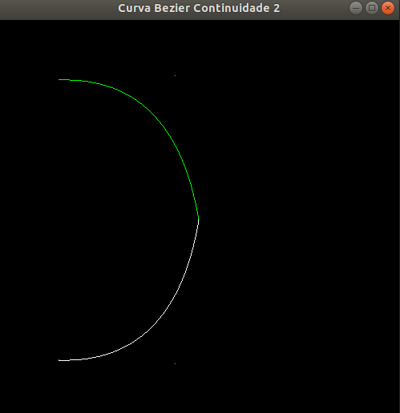</img></h1>

## Curva de Bezier por parte (usar três partes).
Criar uma curva mais complexa, usando uma curva de Bezier por parte (usar três partes)
Mostra a curva no quarto quadrante, de um sistema de coordenadas com o centro do sistema no centro da janela
### Exemplos:
<h1 align="center">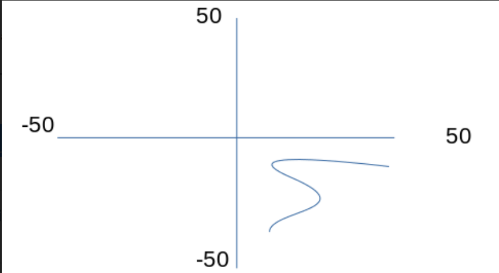</img></h1>

```bash
Curva Bezier por parte: mais Complexa
```
```bash
#include <GL/gl.h>
#include <GL/glu.h>
#include <stdlib.h>
#include <GL/glut.h>

GLfloat ctrlpoints2[4][3]={
{ 1.0, -2.8, 0.0},
{ 1.0, -2.2, 0.0},
{ 3.0, -2.2, 0.0},
{ 1.2, -1.7, 0.0}
};

GLfloat ctrlpoints6[4][3]={
{ 1.2,-1.7, 0.0},
{ 0.4,-1.4, 0.0},
{ 1.8,-0.9, 0.0},
{ 2.2,-0.9, 0.0}
}; 

void init(void)
{
glClearColor(0.0, 0.0, 0.0, 0.0);
glShadeModel(GL_FLAT);
glEnable(GL_MAP1_VERTEX_3);
}

void display(void)
{
int i;

glClear(GL_COLOR_BUFFER_BIT);

glPointSize(0.0f); //tamanho do ponto verde / O código a seguir exibe os pontos de controle como pontos /

glMap1f(GL_MAP1_VERTEX_3, 0.0,1.0,3,4, &ctrlpoints2[0][0]); 
glColor3f(0.0, 1.0, 0.0); //cor verde

glBegin(GL_LINE_STRIP);
for (i = 0; i <= 30; i++){ 
glEvalCoord1f((GLfloat) i/30.0);
}
glEnd();

glBegin(GL_POINTS);
for (i = 0; i < 4; i++) 
glVertex3fv(&ctrlpoints2[i][0]);
glEnd();

//CURVA 2
glMap1f(GL_MAP1_VERTEX_3, 0.0, 1.0, 3, 4, &ctrlpoints6[0][0]);
glColor3f(0.0, 1.0, 0.0); //COR VERDE

glBegin(GL_LINE_STRIP);
for (int j = 0; j <= 30; j++) {
glEvalCoord1f((GLfloat)j / 30.0);
}
glEnd();

glBegin(GL_POINTS);
for (int i = 0; i < 4; i++) {
glVertex3fv(&ctrlpoints6[i][0]);
}
glEnd();
glFlush();
}

void reshape(int w, int h)
{
glViewport(0, 0, (GLsizei) w, (GLsizei) h);
glMatrixMode(GL_PROJECTION);
glLoadIdentity();
if (w <= h)
glOrtho(-5.0, 5.0, -5.0*(GLfloat)h/(GLfloat)w, 
5.0*(GLfloat)h/(GLfloat)w, -5.0, 5.0);
else
glOrtho(-5.0*(GLfloat)w/(GLfloat)h, 
5.0*(GLfloat)w/(GLfloat)h, -5.0, 5.0, -5.0, 5.0);
glMatrixMode(GL_MODELVIEW);
glLoadIdentity();
}

int main(int argc, char** argv)
{
glutInit(&argc, argv);
glutInitDisplayMode (GLUT_SINGLE | GLUT_RGB);
glutInitWindowSize (500, 500);
glutInitWindowPosition (100, 100);
glutCreateWindow("Curva mais Complexa-Bezier-Continuidade"); //cria a janela
init ();
glutDisplayFunc(display);
glutReshapeFunc(reshape);
glutMainLoop();
return 0;
}
```
## RESULTADO Curva mais Complexa:

<h1 align="center">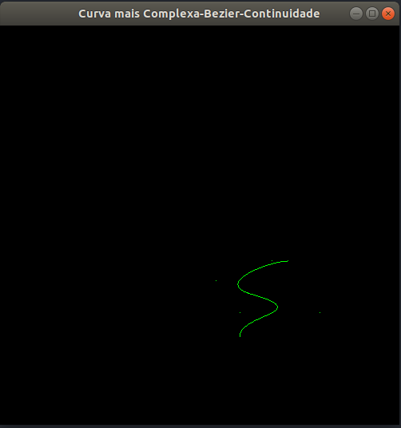</img></h1>

```bash
Curva Bezier por parte: mais Complexa no quarto quadrante, de um sistema de coordenadas.
```
```bash
#include <GL/gl.h>
#include <GL/glu.h>
#include <stdlib.h>
#include <GL/glut.h>

GLfloat ctrlpoint1[4][3] = {
{0.8, -3.0, 0.0},
{0.8, -2.5, 0.0},
{4.0, -2.3, 0.0},
{1.0, -1.6, 0.0}
};

GLfloat ctrlpoint2[4][3] = {
{1.0, -1.6, 0.0},
{0.4, -1.2, 0.0},
{1.3, -1.25, 0.0},
{2.0, -1.26, 0.0}
};

GLfloat ctrlpoint3[4][3] = {
{2.0, -1.26, 0.0},
{2.4, -1.27, 0.0},
{2.8, -1.28, 0.0},
{3.1, -1.33, 0.0}
};

void eixo()
{
glColor3f(0.0, 0.0, 1.0);
glBegin(GL_LINES);
glVertex2f(-50., 0);
glVertex2f(50.0, 0);
glVertex2f(0, -50.0);
glVertex2f(0, 50.0);
glEnd();
};

void init(void) {
glClearColor(1.0, 1.0, 1.0, 1.0);
glOrtho(-5, 5, -5, 5, -1, 1);
glEnable(GL_MAP1_VERTEX_3);
}

void display(void) {

glClear(GL_COLOR_BUFFER_BIT);

glPointSize(0.0);

eixo();
glMap1f(GL_MAP1_VERTEX_3, 0.0, 1.0, 3, 4, &ctrlpoint1[0][0]);

glColor3f(0.0, 0.0, 1.0);

glBegin(GL_LINE_STRIP);
for (int j = 0; j <= 30; j++) {
glEvalCoord1f((GLfloat)j / 30.0);
}
glEnd();

glBegin(GL_POINTS);
for (int i = 0; i < 4; i++) {
glVertex3fv(&ctrlpoint1[i][0]);
}
glEnd();

//CURVA 2
glMap1f(GL_MAP1_VERTEX_3, 0.0, 1.0, 3, 4, &ctrlpoint2[0][0]);

glColor3f(0.0, 0.0, 1.0);

glBegin(GL_LINE_STRIP);
for (int j = 0; j <= 30; j++) {
glEvalCoord1f((GLfloat)j / 30.0);
}
glEnd();

glBegin(GL_POINTS);
for (int i = 0; i < 4; i++) {
glVertex3fv(&ctrlpoint2[i][0]);
}
glEnd();

//CURVA 3
glMap1f(GL_MAP1_VERTEX_3, 0.0, 1.0, 3, 4, &ctrlpoint3[0][0]);

glColor3f(0.0, 0.0, 1.0);

glBegin(GL_LINE_STRIP);
for (int j = 0; j <= 30; j++) {
glEvalCoord1f((GLfloat)j / 30.0);
}
glEnd();

glBegin(GL_POINTS);
for (int i = 0; i < 4; i++) {
glVertex3fv(&ctrlpoint3[i][0]);
}
glEnd();

glFlush();
glutSwapBuffers();

}

void reshape(int w, int h)
{
glViewport(0, 0, (GLsizei)w, (GLsizei)h);
glMatrixMode(GL_PROJECTION);
glLoadIdentity();
if (w <= h)
glOrtho(-5.0, 5.0, -5.0 * (GLfloat)h / (GLfloat)w,
5.0 * (GLfloat)h / (GLfloat)w, -5.0, 5.0);
else
glOrtho(-5.0 * (GLfloat)w / (GLfloat)h,
5.0 * (GLfloat)w / (GLfloat)h, -5.0, 5.0, -5.0, 5.0);
glMatrixMode(GL_MODELVIEW);
glLoadIdentity();
}

int main(int argc, char** argv)
{
glutInit(&argc, argv);
glutInitDisplayMode (GLUT_SINGLE | GLUT_RGB);
glutInitWindowSize (500, 500);
glutInitWindowPosition (100, 100);
glutCreateWindow("Curva de Bezier Mais Complexa"); //cria a janela
init ();
glutDisplayFunc(display);
glutReshapeFunc(reshape);
glutMainLoop();
return 0;
}

```
## RESULTADO Curva mais Complexa:

<h1 align="center">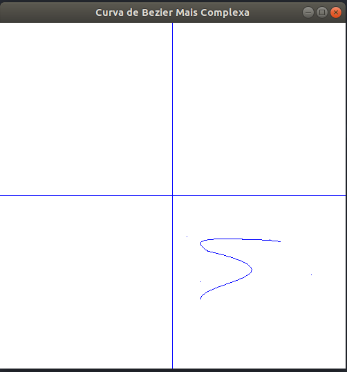</img></h1>


```bash
Curva Bezier por parte: mais Complexa.
```
```bash
#include <GL/gl.h>
#include <GL/glu.h>
#include <stdlib.h>
#include <GL/glut.h>

GLfloat ctrlpoints2[4][3] = {
  {1.8, -3.0, 0.0},
  {1.8, -2.5, 0.0},
  {4.0, -2.3, 0.0},
  {1.0, -1.6, 0.0}
};

GLfloat ctrlpoints6[4][3] = {
  {1.0, -1.6, 0.0},
  {0.4, -1.2, 0.0},
  {1.3, -1.25, 0.0},
  {2.0, -1.26, 0.0}
};


void init(void) {
   glClearColor(0.0, 0.0, 0.0, 0.0); //cor fundo preto
    glOrtho(-5, 5, -5, 5, -1, 1);
    glEnable(GL_MAP1_VERTEX_3);
}

void display(void) {

    glClear(GL_COLOR_BUFFER_BIT);

    glPointSize(0.0);

   
    glMap1f(GL_MAP1_VERTEX_3, 0.0, 1.0, 3, 4, &ctrlpoints2[0][0]);

    glColor3f(0.0, 1.0, 0.0); //cor verde

    glEvalMesh1(GL_LINE_STRIP,0,30); 
    glBegin(GL_LINE_STRIP);
    for (int j = 0; j <= 30; j++) {
        glEvalCoord1f((GLfloat)j / 30.0); //gera um vertice usando o parámetro
    }
    glEnd();

    glBegin(GL_POINTS);
    for (int i = 0; i < 4; i++) {
        glVertex3fv(&ctrlpoints2[i][0]);
    }
    glEnd();

    //CURVA 2
    glMap1f(GL_MAP1_VERTEX_3, 0.0, 1.0, 3, 4, &ctrlpoints6[0][0]);

    glColor3f(0.0, 0.0, 1.0); //cor azul

    glBegin(GL_LINE_STRIP);
    for (int j = 0; j <= 30; j++) {
        glEvalCoord1f((GLfloat)j / 30.0);
    }
    glEnd();

    glBegin(GL_POINTS);
    for (int i = 0; i < 4; i++) {
        glVertex3fv(&ctrlpoints6[i][0]);
    }
    glEnd();

    glFlush();
    glutSwapBuffers();

}

void reshape(int w, int h)
{
    glViewport(0, 0, (GLsizei)w, (GLsizei)h);
    glMatrixMode(GL_PROJECTION);
    glLoadIdentity();
    if (w <= h)
        glOrtho(-5.0, 5.0, -5.0 * (GLfloat)h / (GLfloat)w,
            5.0 * (GLfloat)h / (GLfloat)w, -5.0, 5.0);
    else
        glOrtho(-5.0 * (GLfloat)w / (GLfloat)h,
            5.0 * (GLfloat)w / (GLfloat)h, -5.0, 5.0, -5.0, 5.0);
    glMatrixMode(GL_MODELVIEW);
    glLoadIdentity();
}


int main(int argc, char** argv)
{
   glutInit(&argc, argv);
   glutInitDisplayMode (GLUT_SINGLE | GLUT_RGB);
   glutInitWindowSize (500, 500);
   glutInitWindowPosition (100, 100);
    glutCreateWindow("Curva Complexa Bezier Continuidade");               //cria a janela
   init ();
   glutDisplayFunc(display);
   glutReshapeFunc(reshape);
   glutMainLoop();
   return 0;
}
```
## RESULTADO Curva mais Complexa:

<h1 align="center">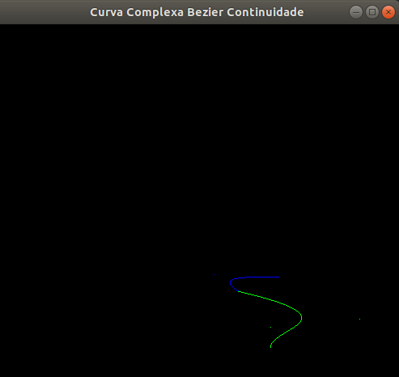</img></h1>
