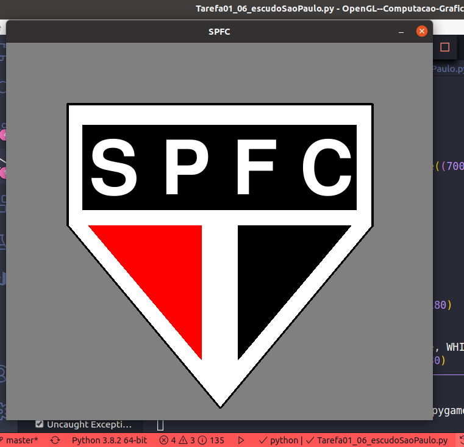
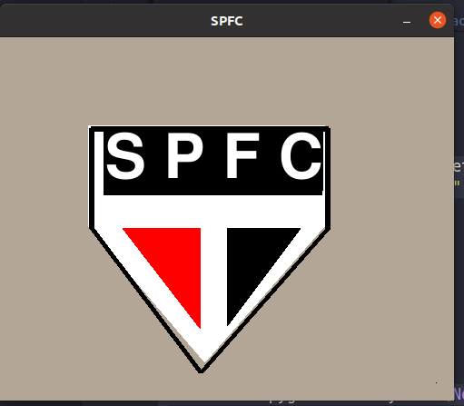
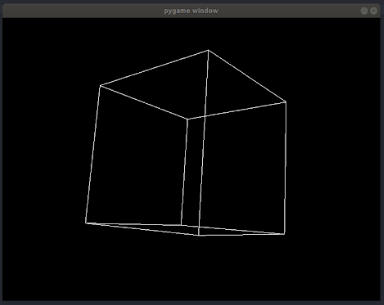
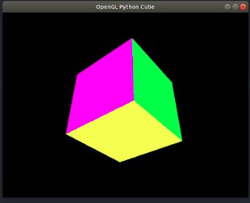
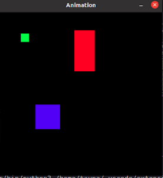
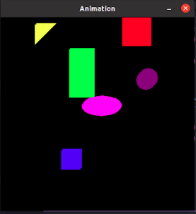

<h1 align="center"> Usando OpenGL e Pygame (2020)</h1>

## :books: Instalação

Execute os seguintes passos para **instalar PyOpenGL**:

- 1. Instalar PyOpenGL e PyOpenGL_accelerate
  - pip install PyOpenGL PyOpenGL_accelerate 

- 2. Instalar Pygame
  - pip install Pygame

- 3. Testar os exemplos
```bash
Other (2019)
```
- 1. Instalar Python 
  (https://www.lfd.uci.edu/~gohlke/pythonlibs/)
- 2. Instalar PyOpenGL 
- Exemplo: PyOpenGL‑3.1.3b2‑cp37‑cp37m‑win_amd64.whl en (https://www.lfd.uci.edu/~gohlke pythonlibs/)
- 3.  PyOpenGL_accelerate 
 - PyOpenGL_accelerate‑3.1.3b2‑cp37‑cp37m‑win_amd64.whl
- 4.   Instalar Pygame 
 - Pygame (pygame-1.9.4-cp37-cp37m-win_amd64.whl)
  - pip install pygame-1.9.4-cp37-cp37m-win_amd64.whl
```bash
Exemplo
```
https://pythonprogramming.net/opengl-rotating-cube-example-pyopengl-tutorial/

###  Exercícios com Solução - OpenGL e Pygame na Computação Gráfica

Baseados no código "exemplo7.py" fazer o Escudo do São Paulo Futebol Clube
```bash

import pygame, sys
from pygame.locals import *

# inicia o pygame
pygame.init()
# inicia a janela
windowSurface = pygame.display.set_mode((700, 620), 0, 32)
pygame.display.set_caption("SPFC")

# inicia as cores utilizadas
BLACK = (0, 0, 0)
WHITE = (255, 255, 255)
RED = (255, 0, 0)
GRAY = (128, 128, 128)

# inicia as fontes
basicFont = pygame.font.SysFont(None, 180)

# inicia o texto
text = basicFont.render("S P F C", True, WHITE, BLACK)
textRect = pygame.Rect(135, 150, 300, 80)

# desenha o fundo cinza
windowSurface.fill(GRAY)


# desenha o polígono branco que corresponde ao escudo
pygame.draw.polygon(windowSurface, WHITE,
                    (
                        (100, 300),
                        (100, 100),
                        (600, 100),
                        (600, 300),
                        (350, 600)))

# desenha os triângulos do escudo
pygame.draw.polygon(windowSurface, RED, ((135, 300),(320, 300),(320, 520)))
pygame.draw.polygon(windowSurface, BLACK, ((565, 300),(380, 300),(380, 520)))

# desenha as linhas pretas que contornam o escudo
pygame.draw.line(windowSurface, BLACK, (100, 300),(100, 100), 4)
pygame.draw.line(windowSurface, BLACK, (100, 100),(600, 100), 4)
pygame.draw.line(windowSurface, BLACK, (600, 100),(600, 300), 4)
pygame.draw.line(windowSurface, BLACK, (600, 300),(350, 600), 4)
pygame.draw.line(windowSurface, BLACK, (350, 600),(100, 300), 4)

# desenha o retângulo do fundo do texto na superfície
pygame.draw.rect(windowSurface, BLACK, (textRect.left -10, textRect.top -15,textRect.width + 150, textRect.height + 60))

# obtem um array de pixel da superficie
pixArray = pygame.PixelArray(windowSurface)
pixArray[480][380] = BLACK
del pixArray

# desenha o texto na janela
windowSurface.blit(text, textRect)

# desenha a janela na tela
pygame.display.update()

# roda o loop do jogo
while True:
    for event in pygame.event.get():
        if event.type == QUIT:
            pygame.quit()
            sys.exit()

```
## RESULTADO: Tarefa 01_06  Escudo do São Paulo Futebol Clube

<h1 align="center"></img></h1>


Baseados no código "exemplo7.py" fazer o Escudo do São Paulo Futebol Clube
```bash

import pygame, sys
from pygame.locals import *

# inicia o pygame
pygame.init()
# inicia a janela
windowSurface = pygame.display.set_mode((700, 620), 0, 32)
pygame.display.set_caption("SPFC")

# inicia as cores utilizadas
BLACK = (0, 0, 0)
WHITE = (255, 255, 255)
RED = (255, 0, 0)
GRAY = (128, 128, 128)

# inicia as fontes
basicFont = pygame.font.SysFont(None, 180)

# inicia o texto
text = basicFont.render("S P F C", True, WHITE, BLACK)
textRect = pygame.Rect(135, 150, 300, 80)

# desenha o fundo cinza
windowSurface.fill(GRAY)


# desenha o polígono branco que corresponde ao escudo
pygame.draw.polygon(windowSurface, WHITE,
                    (
                        (100, 300),
                        (100, 100),
                        (600, 100),
                        (600, 300),
                        (350, 600)))

# desenha os triângulos do escudo
pygame.draw.polygon(windowSurface, RED, ((135, 300),(320, 300),(320, 520)))
pygame.draw.polygon(windowSurface, BLACK, ((565, 300),(380, 300),(380, 520)))

# desenha as linhas pretas que contornam o escudo
pygame.draw.line(windowSurface, BLACK, (100, 300),(100, 100), 4)
pygame.draw.line(windowSurface, BLACK, (100, 100),(600, 100), 4)
pygame.draw.line(windowSurface, BLACK, (600, 100),(600, 300), 4)
pygame.draw.line(windowSurface, BLACK, (600, 300),(350, 600), 4)
pygame.draw.line(windowSurface, BLACK, (350, 600),(100, 300), 4)

# desenha o retângulo do fundo do texto na superfície
pygame.draw.rect(windowSurface, BLACK, (textRect.left -10, textRect.top -15,textRect.width + 150, textRect.height + 60))

# obtem um array de pixel da superficie
pixArray = pygame.PixelArray(windowSurface)
pixArray[480][380] = BLACK
del pixArray

# desenha o texto na janela
windowSurface.blit(text, textRect)

# desenha a janela na tela
pygame.display.update()

# roda o loop do jogo
while True:
    for event in pygame.event.get():
        if event.type == QUIT:
            pygame.quit()
            sys.exit()

```
## RESULTADO: Testes Escudo do São Paulo Futebol Clube

<h1 align="center"></img></h1>

## RESULTADO: Tarefa Aula 29-05

## Quadrado:
<h1 align="center"></img></h1>

## Cruz:
<h1 align="center"></img></h1>

## Cubo:
<h1 align="center"></img></h1>


## Aula 15_06 Animações em pygame
Executar e estudar o código, e sobre esse exemplo e usando o exemplo trabalhado na aula anterior fazer:

a-Adicionar outra forma geométricas 
b- Mudar as formas geométricas
c- Definir velocidades distintas para cada forma geométrica

Postar três arquivos
1. Resultado de executar o código exemplo.
2. arquivo .py com as modificações do código
3. Imagem da execução do segundo código

### Exemplo: Três Formas geométricas
<h1 align="center"></img></h1>

```bash
Aula 15_06 Animações em pygame
```
```bash
import pygame, sys, time
from pygame.locals import *

# set up pygame
pygame.init()

# set up the window
WINDOWWIDTH = 400
WINDOWHEIGHT = 400
windowSurface = pygame.display.set_mode((WINDOWWIDTH, WINDOWHEIGHT), 0, 32)
pygame.display.set_caption('Animation')

# set up direction variables 
DOWNLEFT = 2
DOWNRIGHT = 5
UPLEFT = 8
UPRIGHT = 6


# set up the colors 
BLACK = (0, 0, 0)
RED = (255, 0, 0)
GREEN = (0, 255, 0)
BLUE = (0, 0, 255)
MAGENTA= (255, 0, 255)
PURPLE = (128, 0, 128)
YELLOW = (255, 255, 0)


# set up the block data structure 
b1 = {'rect':pygame.Rect(100, 150, 60, 60), 'color':RED, 'dir':UPRIGHT, 'speed': 1}
b2 = {'rect':pygame.Rect(300, 80, 50, 100), 'color':GREEN, 'dir':UPLEFT, 'speed': 2}
b3 = {'rect':pygame.Rect(200, 200, 40, 40), 'color':BLUE, 'dir':DOWNLEFT, 'speed': 3}


# Insere as novas formas geométricas
b4 = {'rect':pygame.Rect(146, 0, 40, 40), 'color':YELLOW, 'dir':UPLEFT, 'speed': 3}
b5 = {'rect':pygame.Rect(300, 50, 10, 10), 'color':PURPLE, 'dir':DOWNLEFT, 'speed': 5}
b6 = {'rect':pygame.Rect(300, 200, 90, 70), 'color':BLUE, 'dir':DOWNLEFT, 'speed': 3}
b6 = {'rect':pygame.Rect(300, 200, 80, 40), 'color':MAGENTA, 'dir':UPRIGHT, 'speed': 2}

blocks = [b1, b2, b3, b4, b5, b6]


# run the game loop
while True:
    # check for the QUIT event
    for event in pygame.event.get():
        if event.type == QUIT:
            pygame.quit()
            sys.exit()


    # draw the black background onto the surface
    windowSurface.fill(BLACK)

    for b in blocks:
        # move the block data structure
        if b['dir'] == DOWNLEFT:
            b['rect'].left -= b['speed']
            b['rect'].top += b['speed']
        if b['dir'] == DOWNRIGHT:
            b['rect'].left += b['speed']
            b['rect'].top += b['speed']
        if b['dir'] == UPLEFT:
            b['rect'].left -= b['speed']
            b['rect'].top -= b['speed']
        if b['dir'] == UPRIGHT:
            b['rect'].left += b['speed']
            b['rect'].top -= b['speed']

        # check if the block has move out of the window
        if b['rect'].top < 0:
            # block has moved past the top
            if b['dir'] == UPLEFT:
                b['dir'] = DOWNLEFT
            if b['dir'] == UPRIGHT:
                b['dir'] = DOWNRIGHT
        if b['rect'].bottom > WINDOWHEIGHT:
            # block has moved past the bottom
            if b['dir'] == DOWNLEFT:
                b['dir'] = UPLEFT
            if b['dir'] == DOWNRIGHT:
                b['dir'] = UPRIGHT
        if b['rect'].left < 0:
            # block has moved past the left side
            if b['dir'] == DOWNLEFT:
                b['dir'] = DOWNRIGHT
            if b['dir'] == UPLEFT:
                b['dir'] = UPRIGHT
        if b['rect'].right > WINDOWWIDTH:
            # block has moved past the right side
            if b['dir'] == DOWNRIGHT:
                b['dir'] = DOWNLEFT
            if b['dir'] == UPRIGHT:
                b['dir'] = UPLEFT

       
        # Formas geométricas
        pygame.draw.rect(windowSurface, b1['color'], b1['rect'])
        pygame.draw.rect(windowSurface, b2['color'], b2['rect'])
        pygame.draw.rect(windowSurface, b3['color'], b3['rect'])

        # Novas formas geométricas
        pygame.draw.polygon(windowSurface, b4['color'], ((b4['rect'].topleft),(b4['rect'].topright),(b4['rect'].bottomleft)))
        pygame.draw.circle(windowSurface, b5['color'], b5['rect'].topleft, 20, 0)
        pygame.draw.ellipse(windowSurface, b6['color'], b6['rect'])


    # draw the window onto the screen
    pygame.display.update()
    time.sleep(0.02)
```
## RESULTADO: Aula 15_06 Animações em pygame

## Outra forma geométricas
<h1 align="center"></img></h1>


----------
Feito com ♥ by Tayna Rodrigues - Manaus-AM  👋 