### RESULTADOS:

## Cubo4:

<h1 align="center">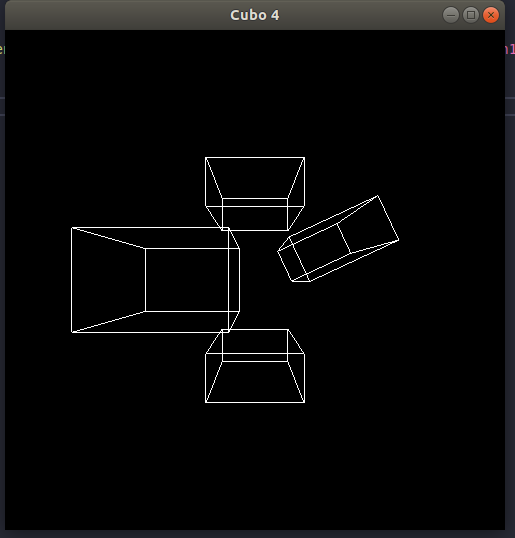</img></h1>

## frases:

<h1 align="center">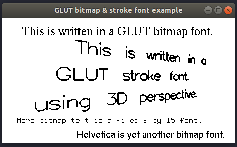</img></h1>

## iluminação:

<h1 align="center">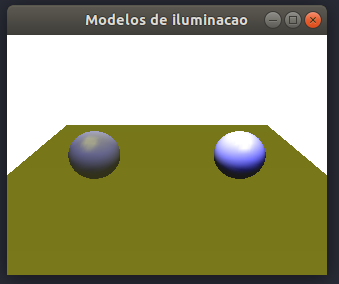</img></h1>

## objetos:

<h1 align="center">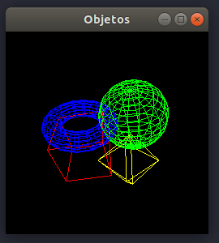</img></h1>

## padrão:

<h1 align="center"></img></h1>

## pickSquare:

<h1 align="center">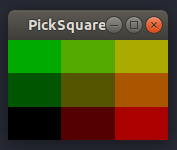</img></h1>

## planetas:

<h1 align="center">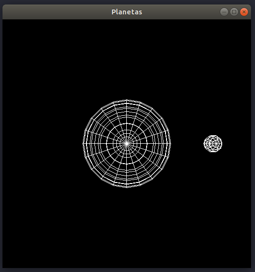</img></h1>

## polys:

<h1 align="center">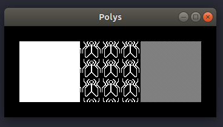</img></h1>

## primitivosSolidos:

<h1 align="center">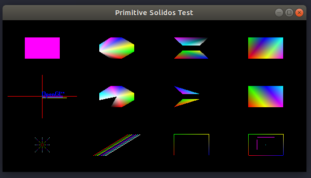</img></h1>

## selecaoBS:

<h1 align="center">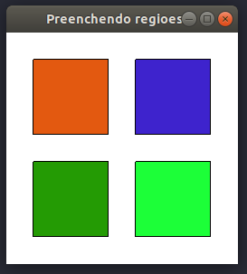</img></h1>

## splines3D:

<h1 align="center">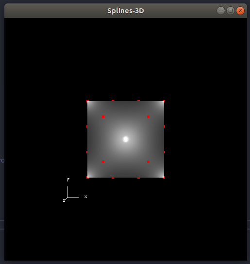</img></h1>

## tracos:

<h1 align="center">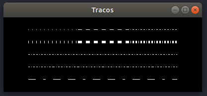</img></h1>
